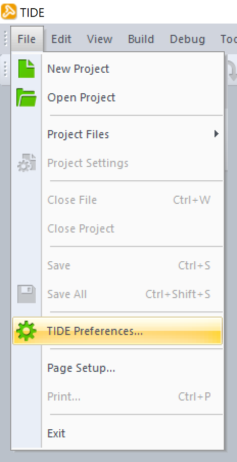
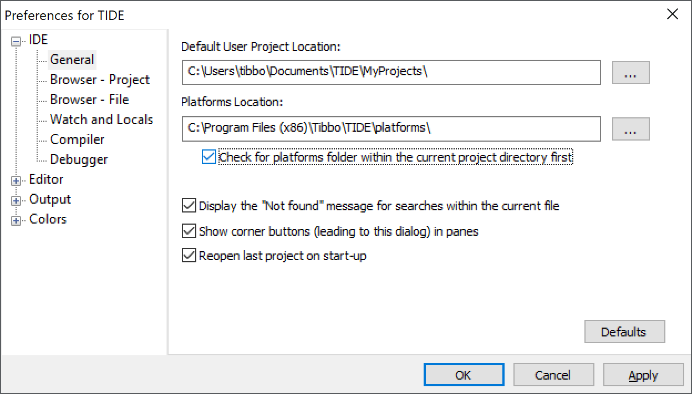

# WM2000EV Demos #
## Introduction ##
This repository contains the official demonstration projects that showcase the features of Tibbo's WM2000 programmable wireless IIoT module ([product page](https://tibbo.com/store/modules/wm2000.html) | [documentation](https://docs.tibbo.com/phm/wm2000)) in conjunction with the WM2000EV evaluation board ([product page](https://tibbo.com/store/devkits.html) | [documentation](https://docs.tibbo.com/phm/wm2000ev)).

Each project consists of a [Tibbo BASIC](https://tibbo.com/programmable.html#language) application and includes all of the necessary files for compilation in [Tibbo IDE (TIDE)](https://tibbo.com/programmable.html#tide). When opening these projects in TIDE, make sure to enable the "Check for platforms folder within the current project directory first" option inside the TIDE Preferences, as illustrated below. 

 

This ensures that each application uses its included libraries. Also included in the platforms folder is the firmware version that the device is intended to use for this project.

The WM2000 is a "wireless-first" IIoT module that is programmable in Tibbo BASIC and Tibbo C. It features Wi-Fi (802.11a/b/g/n over 2.4GHz/5GHz) and Bluetooth Low Energy (BLE) interfaces that support automatic network association, wireless debugging, over-the-air (OTA) updates, secure sockets through Transport Layer Security (TLS), and other functionality. The module incorporates two high-speed serial ports, I²C/SPI ports, onboard flash and EEPROM, a real-time clock that enables a low-power mode, and 10 GPIO lines.

The WM2000EV is a board for evaluating the WM2000. It provides the minimum hardware required to test out the WM2000's various features, including pulse-width modulation (PWM), Wi-Fi and BLE connectivity, and the low-power mode. The board also facilitates connecting external hardware to each of the module's pins and measuring the current consumption of the board and/or module via dedicated terminals. It can be powered via an integrated USB Type-C connector or a two-pin terminal block connector for 3V-5.5V power input.

 

## Included Projects ##
### Keen ###
This application is pre-loaded at the factory on the WM2000 that is included in each WM2000EV kit. The project requires absolutely no coding by the user and demonstrates how quick and straightforward the configuration of the WM2000 as an IIoT sensor node can be. In as little as 5 minutes, your WM2000 will be securely transmitting sensor data to a nonaffiliated, third-party cloud services provider — [Keen](https://keen.io), in this case.

This project demonstrates the following functionality of the WM2000:
* Using L.U.I.S. (Loadable User Interface System) to configure the device over BLE
* Automatic association with a Wi-Fi network
* Scheduled, redundant, and secure data transmission through TLS
* Polling the built-in light and temperature sensors
* Storing data in the integrated flash disk
* Time synchronization
* Playing patterns of light through the integrated RGB LED

Detailed, step-by-step instructions for using this application are available at [Tibbo Docs](https://docs.tibbo.com/phm/wm2000ev_start).